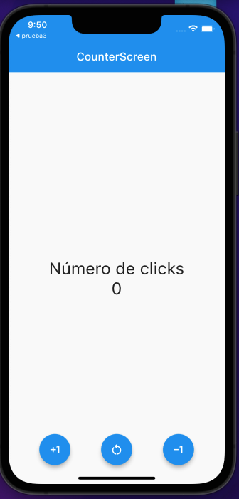

# counter_app

Aplicación básica de un contador

## Descripción

Una breve introducción al gestor de estados con setState y enviando los parámetros del Widget padre al hijo.   
No es la forma correcta pero es una introducción.

